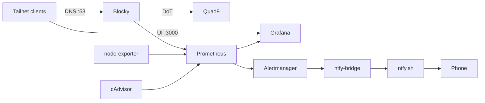

# Pi Homelab

A self-hosted monitoring and network DNS stack running on a Raspberry Pi 4, fully reachable over Tailscale. Metrics are scraped by Prometheus, visualized in Grafana (dashboards provisioned from code), alerts are routed through Alertmanager to ntfy.sh for phone push notifications, and Tailnet DNS is filtered through Blocky.

## Architecture



Blocky and Grafana are bound to the host's Tailscale IP. Prometheus, node-exporter, and cAdvisor are reachable only inside the Docker bridge network.

## Stack

| Service | Role | Port (Tailnet) |
|---|---|---|
| Blocky | DNS with ad-blocking, DoT upstream to Quad9 | 53 |
| Prometheus | Metrics storage and scraping | internal |
| Alertmanager | Alert routing to ntfy.sh push notifications | internal |
| ntfy-bridge | Translates Alertmanager webhooks into ntfy.sh pushes | internal |
| Grafana | Dashboards (provisioned as code) | 3000 |
| node-exporter | Host metrics | internal |
| cAdvisor | Container metrics | internal |

Tailscale runs on the host, not in the compose stack, and provides the zero-trust overlay.

## Setup

1. Clone and configure:

```bash
git clone https://github.com/jglunn/homelab.git
cd homelab
cp .env.example .env
# edit .env: set TS_IP, GRAFANA_ADMIN_PASSWORD, TZ, NTFY_TOPIC
```

Pick a random, unguessable string for `NTFY_TOPIC` — anyone with the topic name
can read your alerts. Install the [ntfy app](https://ntfy.sh) on your phone and
subscribe to the same topic to receive pushes.

2. Install Tailscale on the host:

```bash
curl -fsSL https://tailscale.com/install.sh | sh
sudo tailscale up --ssh
tailscale ip -4   # copy this into .env as TS_IP
```

3. Install Docker:

```bash
curl -fsSL https://get.docker.com | sh
sudo usermod -aG docker $USER
# log out and back in
```

4. Launch:

```bash
docker compose up -d
docker compose ps   # verify all services reach healthy state
```

5. In the Tailscale admin console → **DNS**, add the Pi's Tailscale IP as a global nameserver and toggle **Override local DNS**.

## Access

- **Grafana**: `http://<tailscale-ip>:3000` — three dashboards (Node Exporter Full, cAdvisor, Blocky) are provisioned automatically on first boot
- **Prometheus and exporters**: internal only, query via Grafana

## Configuration highlights

- **Tailscale-only port binding** — ports are bound to `${TS_IP}` not `0.0.0.0`, so nothing is exposed on the public interface
- **Per-service resource limits** — memory and CPU caps prevent any one service from starving the Pi
- **Healthchecks with `service_healthy` dependencies** — Prometheus waits for exporters; Grafana waits for Prometheus
- **Dashboards as code** — committed JSON under `grafana/provisioning/dashboards/`, with datasource variables pre-resolved
- **Log rotation** — 10MB × 3 files per service to protect the SD card
- **`no-new-privileges`** on every non-privileged container
- **Alerting** — Prometheus rules in `prometheus/rules/` cover host, container, DNS, and self-monitoring; Alertmanager pushes firing and resolved notifications to [ntfy.sh](https://ntfy.sh) via a small bridge service (`ntfy-bridge/bridge.py`, ~60 lines of stdlib Python) that formats the Alertmanager webhook into a readable title and body

## Screenshots


## License

MIT
